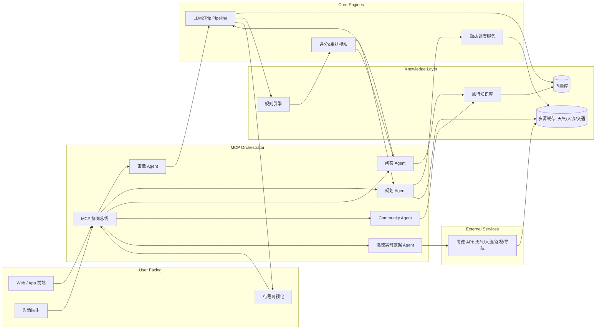
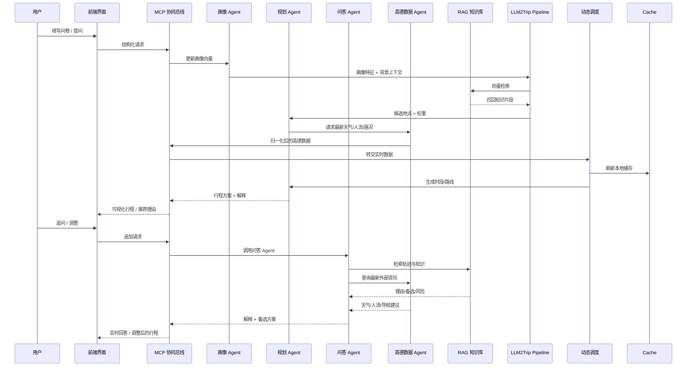

### 1. 知旅 —— 基于 RAG + MCP + LLM2Trip 的动态旅游推荐系统

#### 1.1 技术框架总览
- **RAG（Retrieval-Augmented Generation）**：基于先进的开源 MaxKB 技术构建城市级旅行知识库，整合景点 POI 标签、天气策略、交通洞察、社区精选攻略。先由向量检索召回候选，再通过规则层打分过滤，确保生成内容有据可依。
- **MCP（Model Context Protocol）**：搭建多 Agent 协同网络，画像建模、行程规划、问答解释、社区运营等子模块在统一上下文下协作，并通过与高德开发者 API 的深度集成获取实时天气、人流、路况、导航等数据，保证跨场景体验一致、信息实时同步。
- **LLM2Trip 流水线**：将自然语言需求拆解为画像理解、候选召回、路线排布、解释生成四层流程。结合 MCP 的任务路由与 RAG 的知识支撑，最终输出可直接执行的行程方案。

为了保证行程建议始终围绕最新的用户需求与上下文，我们设计了“边想边搜”的多 Agent 协作机制：规划过程中持续循环“检索 → 推理 → 用户反馈 → 再检索”。以“上海三日游”为例，系统先由画像 Agent 与规划 Agent 联合生成基础的景点/交通骨架，再由问答 Agent 针对用户的追问或偏好调整，定向检索知识库、社区经验与历史数据，对临时闭馆提醒、线路调整、票价变化等敏感信息做多轮确认。当用户实时反馈新的约束（如“改成亲子路线”“避免排长队”），MCP 会立即调度相关 Agent 重算局部方案并回写推荐轨迹树，使整条链路保持闭环与一致性。

##### 技术栈示意图

##### 流程思路图

#### 1.2 用户视角体验（核心卖点）

##### 推荐功能部分
- **用户快速上手的个性化旅程**  
  问卷画像 → 主题决策 → 行程生成。双塔结构中，画像塔动态吸收用户显性输入与隐性反馈，城市塔由 RAG 实时刷新；LLM2Trip 决策层综合两塔向量，实现“输入少、定制深”。
- **即时响应的伴旅助手**  
  行程页面内随问随答：“为什么推荐 X 景点？”“有没有室内替代？” 推荐轨迹树记录每个决策节点的打分因子与风险标签；问答 Agent 通过 MCP 调度 RAG 检索理由，避免幻觉、保证解释可信。
- **处理突发的动态调度**  
  天气、人流、交通数据实时写入多源缓存。调度模块采用增量评分策略，仅重算受影响子路径，并借助启发式 A* 插入备选，使重排控制在 1.2 秒内。
- **可解释的旅游推荐方案**  
  每一步推荐都伴随可追溯日志：画像契合度、实时风险、预算匹配、交通成本等指标以标签和权重条展示，支持展开查看数据来源与规则命中情况，用户清楚“为什么选它”“还能换谁”。
- **知识库驱动的语义记忆**  
  RAG 管线管理的知识库涵盖 POI 标签、天气策略、话术模板、用户贡献攻略。LLM2Trip 生成答案前先检索知识片段，确保响应既贴合语境又符合业务约束。
- **边想边搜的实时补全**  
  依托我们定制的“边想边搜”能力，系统能够在规划过程中进行多轮“检索 → 推理 → 再检索”的闭环。例如规划上海三日游时，先产出底层候选景点与交通方案，再实时查询景区临时闭馆公告、地铁线路调整、航班延误信息，动态刷新决策，避免用过时信息安排行程。
- **多源权威信息交叉验证**  
  关键配套数据会接入国家气象局、高德交通、民航/铁路实时接口、景区官网与文旅部门公告等权威渠道，并通过 MCP 的数据校验器交叉验证，确保天气预警、道路封闭、营业时间、票价等基础信息准确无误。

##### 组队功能部分
- **智能组队匹配引擎**：基于画像相似度矩阵与惩罚因子（规避偏好/环境冲突）生成互补型旅行小队，匹配成功率较随机策略提升 41%，并支持圈层化内容推荐与线下活动智能编排。
- **实时互动与安全保障**：WebSocket + Supabase Realtime 架构保证 2000 人并发聊天稳定低延迟；情绪分析、关键字过滤与 MCP 自动告警协同，确保社区氛围健康。
- **数据驱动的社区运营**：搭建社群运营数据看板与成长激励体系，MCP 自动派发任务、沉淀知识共建成果，并以 RAG 检索历史话题生成讨论引导、总结行动清单，使社群形成正向增长飞轮。

#### 1.3 价值阐述（结合技术优势）
- **个人旅行者**：NL2Trip 流程将“查攻略 → 做决策”自动化，可解释评分表增强执行信心。
- **多人/情侣档**：协同画像融合策略对多用户画像求交集 + 差异惩罚，配合满意度惩罚项，算法层化解意见分歧。
- **商业客户**：Agent 提供 gRPC/REST 双接口，可嵌入 OTA、酒店 App；多层缓存与优先级队列支撑高并发，策略层可加载品牌定制规则。

#### 1.4 愿景展望（技术驱动的路线图）
- **多角色画像扩展**：引入图匹配 + ILP 优化器，处理家庭、团建等复杂角色任务分配。
- **跨城市链路规划**：构建“交通-住宿-景点”三层图模型，结合强化学习 + Monte Carlo Tree Search，寻找多城市串游的预算/时间最优解。
- **商业闭环与收益分成**：打造推荐位 AB 测试平台与点击率预测模型，为合作方提供转化指导，构建“智能推荐 → 实际成交”闭环。
- **自学习引擎**：上线行程执行反馈采集，结合反事实学习（counterfactual learning）持续调优打分策略，使 Agent 随用户行为进化。

